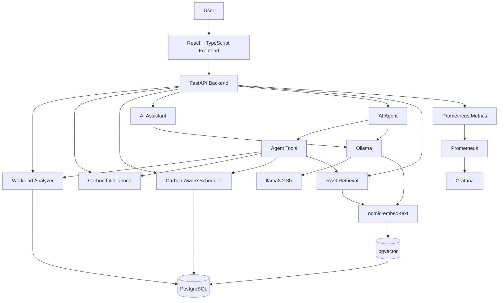
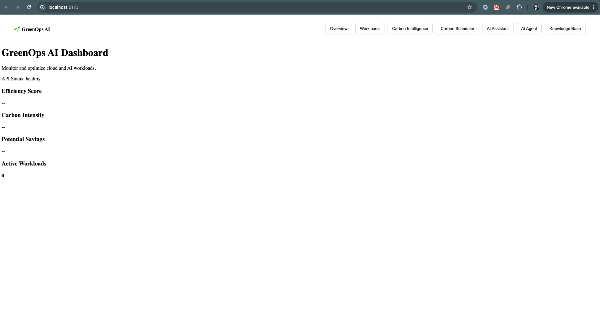
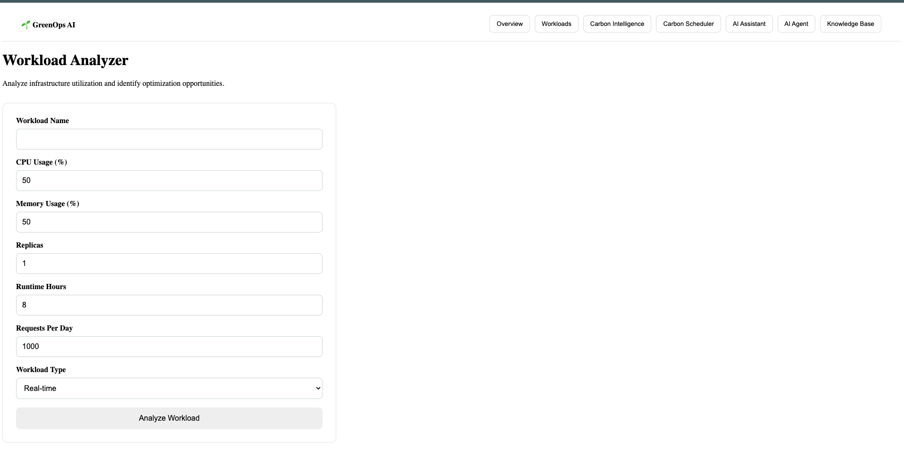
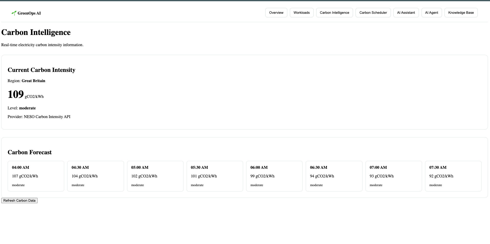
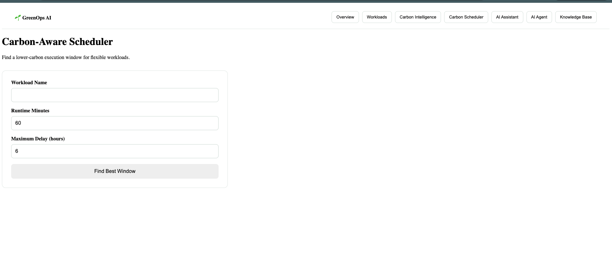
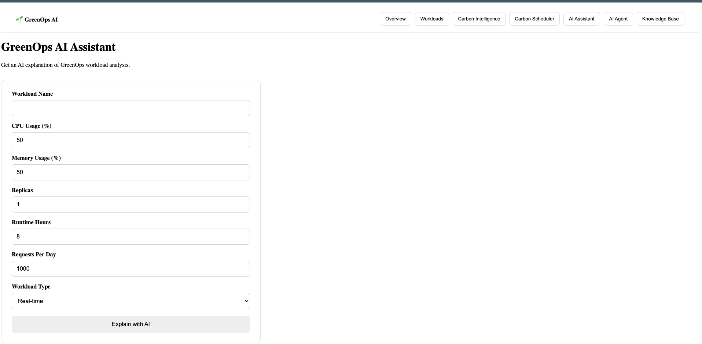
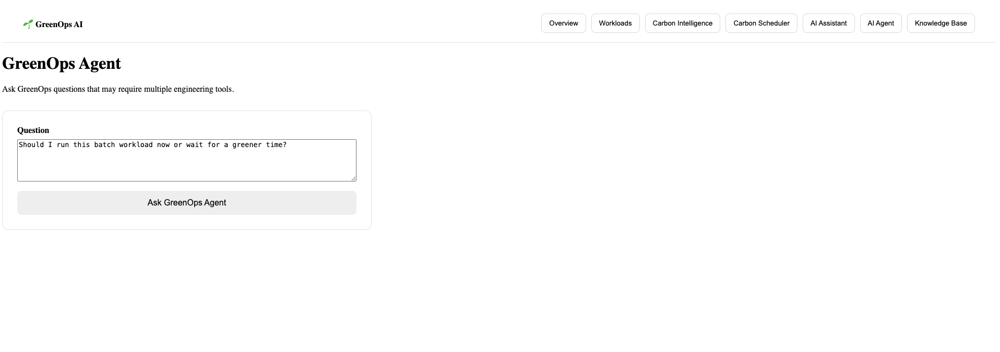
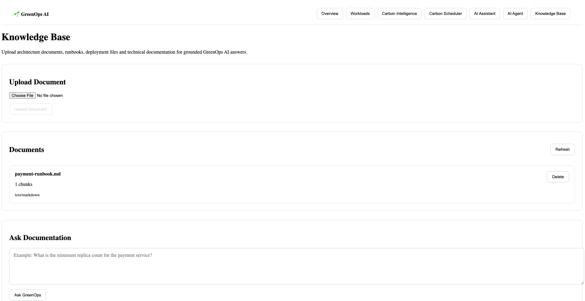
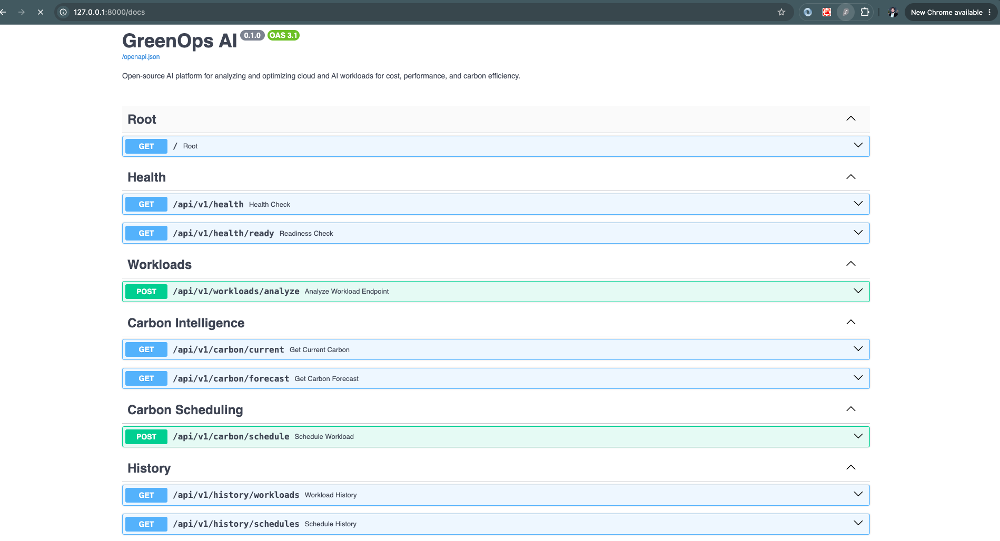

# 🌱 GreenOps AI

[](https://github.com/HamzaZahid172/greenops-ai/actions)


**GreenOps AI** is an open-source AI Engineering and GreenOps platform for analyzing cloud and AI workloads, identifying inefficient resource usage, estimating carbon impact, scheduling workloads during lower-carbon periods, and providing AI-assisted optimization recommendations.

The project combines backend engineering, agentic AI, Retrieval-Augmented Generation (RAG), vector search, local LLMs, evaluation, observability, Docker-based deployment, and CI/CD in one end-to-end system.

---

## Why GreenOps AI?

Modern cloud and AI workloads can consume significant compute resources even when those resources are underutilized.

This can lead to:

- unnecessary infrastructure cost
- wasted CPU and memory
- increased energy consumption
- unnecessary carbon emissions
- inefficient batch and AI workloads

GreenOps AI explores how software engineering and AI can work together to identify these inefficiencies and recommend more sustainable execution strategies.

The project is designed primarily as an AI Engineering and Green Software Engineering learning platform while still following production-oriented engineering practices.

---

## Core Capabilities

GreenOps AI currently provides:

### Workload Analysis

Analyze workload configuration and resource usage.

The workload analyzer can identify:

- CPU over-provisioning
- memory over-provisioning
- inefficient replica configuration
- optimization opportunities
- estimated resource savings

---

### Carbon Intelligence

Fetch and analyze electricity carbon-intensity information.

GreenOps AI uses carbon-intensity data to help users understand whether the current time is relatively suitable for running flexible compute workloads.

---

### Carbon-Aware Scheduling

Delay non-urgent workloads to lower-carbon time windows.

The scheduler evaluates available carbon-intensity forecast data and selects a better execution period within the allowed delay window.

---

### AI Assistant

GreenOps AI includes a local AI assistant powered by Ollama.

The AI assistant can explain:

- workload analysis results
- optimization recommendations
- GreenOps concepts
- sustainability implications
- technical findings

The default local generation model is:

```text
llama3.2:3b
```

No paid cloud LLM API is required.

---

### Agentic AI

GreenOps AI includes an AI agent capable of selecting and executing tools.

Available tool categories include:

- workload analysis
- current carbon-intensity lookup
- lower-carbon scheduling
- documentation search

The agent can decide which tools are required to answer a user request and combine tool results into a final response.

---

### Retrieval-Augmented Generation

GreenOps AI includes a RAG-based Knowledge Base.

Users can upload technical documentation such as:

- runbooks
- architecture documentation
- Markdown files
- text documentation
- configuration documentation

Documents are:

```text
uploaded
   ↓
parsed
   ↓
chunked
   ↓
embedded
   ↓
stored in PostgreSQL + pgvector
   ↓
retrieved through semantic search
   ↓
used as context for grounded AI answers
```

The default embedding model is:

```text
nomic-embed-text
```

---

### Persistent History

Important application results can be persisted in PostgreSQL.

This includes application history for features such as workload analysis and carbon-aware scheduling.

---

### AI Evaluation

GreenOps AI includes its own evaluation framework for testing AI behavior.

The evaluation suite verifies:

- agent tool selection
- required answer content
- forbidden or unsupported claims
- RAG source retrieval
- grounded documentation answers
- tool precision
- tool recall
- latency

Run the evaluation with:

```bash
python -m evaluation.run_evaluation
```

Current evaluation target:

```text
Passed: 4/4
Pass rate: 100.0%
```

Evaluation reports are written to:

```text
evaluation/results/latest.json
```

---

### Observability

GreenOps AI exposes application and AI-specific Prometheus metrics.

Monitored areas include:

- HTTP request count
- HTTP request latency
- LLM generation latency
- AI provider errors
- embedding latency
- RAG retrieval latency
- agent tool execution latency
- agent tool execution count
- tool outcome

Metrics are available from:

```text
http://localhost:8000/metrics
```

---

### Prometheus

Prometheus collects GreenOps AI metrics from the FastAPI backend.

Prometheus UI:

```text
http://localhost:9090
```

---

### Grafana

A provisioned Grafana dashboard visualizes GreenOps AI application and AI performance metrics.

Grafana:

```text
http://localhost:3000
```

Default local credentials:

```text
username: admin
password: greenops
```

The dashboard includes:

- HTTP Request Rate
- HTTP P95 Latency
- LLM Generation P95
- Embedding P95
- RAG Retrieval P95
- Agent Tool Calls

---

## System Architecture



A more detailed architecture description is available in:

```text
docs/ARCHITECTURE.md
```

---

## Technology Stack

### Backend

- Python 3.12
- FastAPI
- SQLAlchemy
- Alembic
- Pydantic
- HTTPX
- Pytest

### Frontend

- React
- TypeScript
- Vite
- Nginx

### AI Engineering

- Ollama
- llama3.2:3b
- nomic-embed-text
- Agentic AI
- Tool calling
- Retrieval-Augmented Generation
- Semantic search
- AI evaluation

### Data

- PostgreSQL
- pgvector

### Sustainability

- Carbon-intensity API integration
- Carbon-aware workload scheduling
- resource-efficiency analysis

### DevOps

- Docker
- Docker Compose
- GitHub Actions
- CI/CD

### Observability

- Prometheus
- Grafana
- application metrics
- AI performance metrics
- request IDs
- readiness checks

---

## Project Structure

```text
greenops-ai/
│
├── backend/
│   ├── alembic/
│   ├── app/
│   │   ├── api/
│   │   ├── core/
│   │   ├── db/
│   │   ├── observability/
│   │   ├── repositories/
│   │   ├── schemas/
│   │   └── services/
│   │       ├── agent/
│   │       ├── ai/
│   │       ├── carbon/
│   │       └── rag/
│   │
│   ├── tests/
│   ├── Dockerfile
│   ├── entrypoint.sh
│   └── requirements.txt
│
├── frontend/
│   ├── src/
│   │   ├── components/
│   │   ├── pages/
│   │   ├── services/
│   │   └── types/
│   │
│   ├── Dockerfile
│   └── nginx.conf
│
├── evaluation/
│   ├── fixtures/
│   ├── results/
│   ├── metrics.py
│   ├── run_evaluation.py
│   └── scenarios.json
│
├── observability/
│   ├── grafana/
│   │   ├── dashboards/
│   │   └── provisioning/
│   │
│   └── prometheus/
│
├── datasets/
├── docs/
├── scripts/
│
├── docker-compose.yml
├── .env.example
├── CONTRIBUTING.md
├── LICENSE
└── README.md
```

---

# Getting Started

## Prerequisites

Install:

- Git
- Docker Desktop
- Ollama

For local development without Docker, also install:

- Python 3.12
- Node.js
- PostgreSQL

---

## Clone the Repository

```bash
git clone https://github.com/HamzaZahid172/greenops-ai.git

cd greenops-ai
```

---

## Configure Environment

Copy the example environment configuration:

```bash
cp .env.example .env
```

Review the values before starting the application.

Do not commit `.env` files containing local credentials or secrets.

---

## Install Ollama Models

GreenOps AI uses Ollama for local AI generation and embeddings.

Install the generation model:

```bash
ollama pull llama3.2:3b
```

Install the embedding model:

```bash
ollama pull nomic-embed-text
```

Verify:

```bash
ollama list
```

You should see:

```text
llama3.2:3b
nomic-embed-text
```

---

# Run with Docker

The recommended way to run GreenOps AI locally is Docker Compose.

Make sure Docker Desktop and Ollama are running.

Then execute:

```bash
docker compose up -d --build
```

Check services:

```bash
docker compose ps
```

Expected services:

```text
backend
db
frontend
prometheus
grafana
```

The PostgreSQL service should report healthy.

---

## Application URLs

### GreenOps AI

```text
http://localhost:5173
```

### FastAPI

```text
http://localhost:8000
```

### Swagger API Documentation

```text
http://localhost:8000/docs
```

### Backend Health

```text
http://localhost:8000/api/v1/health
```

### Backend Readiness

```text
http://localhost:8000/api/v1/health/ready
```

### Prometheus Metrics

```text
http://localhost:8000/metrics
```

### Prometheus

```text
http://localhost:9090
```

### Grafana

```text
http://localhost:3000
```

---

# Local Backend Development

Move to the backend:

```bash
cd backend
```

Create a virtual environment:

```bash
python3 -m venv .venv
```

Activate it on macOS/Linux:

```bash
source .venv/bin/activate
```

Install dependencies:

```bash
pip install -r requirements.txt
```

Start FastAPI:

```bash
uvicorn app.main:app --reload
```

Backend:

```text
http://127.0.0.1:8000
```

Swagger:

```text
http://127.0.0.1:8000/docs
```

---

# Local Frontend Development

From the project root:

```bash
cd frontend
```

Install dependencies:

```bash
npm install
```

Start Vite:

```bash
npm run dev
```

Open:

```text
http://localhost:5173
```

---

# Database Migrations

GreenOps AI uses Alembic.

From `backend/`, apply migrations:

```bash
alembic upgrade head
```

Check the current migration:

```bash
alembic current
```

Check the latest migration:

```bash
alembic heads
```

---

# Testing

## Backend Tests

From `backend/`, run:

```bash
python -m pytest -v
```

The test suite covers areas including:

- health endpoints
- readiness
- carbon services
- workload analysis
- carbon scheduling
- persistence
- AI integration
- agent behavior
- RAG
- observability

---

## Python Compilation Check

```bash
python -m compileall app tests
```

---

## Frontend Lint

```bash
cd frontend

npm run lint
```

---

## Frontend Production Build

```bash
npm run build
```

---

# AI Evaluation

Run from the project root while the GreenOps API and Ollama are available:

```bash
python -m evaluation.run_evaluation
```

The evaluation suite currently contains scenarios for:

```text
agent workload analysis
agent documentation retrieval
RAG payment policy
unsupported documentation fact
```

Expected result:

```text
Passed: 4/4
Pass rate: 100.0%
```

---

# Knowledge Base

The Knowledge Base allows technical documentation to become searchable AI context.

Typical workflow:

```text
Upload Document
      ↓
Document Parser
      ↓
Text Chunking
      ↓
nomic-embed-text
      ↓
pgvector
      ↓
Semantic Search
      ↓
Relevant Context
      ↓
Local LLM
      ↓
Grounded Answer
```

This enables questions such as:

```text
What is the minimum replica count for the payment service?
```

The answer is generated using retrieved documentation rather than relying only on the model's internal knowledge.

---

# Agent Workflow

The GreenOps AI agent follows an agent/tool architecture.

Example:

```text
User Question
     ↓
AI Planner
     ↓
Tool Selection
     ↓
Tool Execution
     ↓
Observation
     ↓
Final AI Response
```

Depending on the request, the agent can use tools such as:

```text
analyze_workload
get_current_carbon
find_low_carbon_window
search_documentation
```

---

# Observability

GreenOps AI includes observability for both normal HTTP operations and AI-specific operations.

Example metric categories:

```text
HTTP requests
HTTP latency

LLM generation latency
AI provider errors

embedding latency

RAG retrieval latency

agent tool execution latency
agent tool execution outcomes
```

This makes it possible to inspect not only whether the API works, but also how the AI components behave operationally.

---

# CI/CD

GitHub Actions performs automated quality checks for changes pushed to the repository and pull requests.

The CI pipeline validates areas such as:

```text
backend tests
frontend quality
production builds
Docker build validation
```

This helps prevent regressions before code is merged.

---

# Engineering Goals

GreenOps AI is designed to demonstrate practical engineering concepts rather than only provide an AI chat interface.

The project brings together:

```text
Backend Engineering
        +
Frontend Engineering
        +
AI Engineering
        +
Agentic AI
        +
RAG
        +
Vector Databases
        +
Evaluation
        +
Green Software Engineering
        +
DevOps
        +
Observability
```

---

# Current Release

```text
GreenOps AI v1.0.0
```

The first major release focuses on an end-to-end local AI Engineering and GreenOps platform with reproducible development, testing, evaluation, and observability.

---

# Planned Improvements

Future versions may include:

- Kubernetes deployment
- Helm charts
- authentication and authorization
- multi-user support
- additional cloud providers
- AWS workload discovery
- additional carbon-intensity providers
- advanced agent planning
- multi-model routing
- model efficiency benchmarking
- AI inference cost estimation
- richer Grafana dashboards
- distributed tracing

These enhancements are intentionally kept outside the initial v1.0 scope so the core platform remains focused and reproducible.

---

# Known Limitations

GreenOps AI is currently primarily designed for local development and engineering experimentation.

Current limitations include:

- no user authentication
- no multi-tenant isolation
- local Ollama dependency for AI features
- limited carbon-data provider coverage
- workload inputs are primarily user-provided rather than automatically discovered from cloud infrastructure
- Kubernetes deployment is not included in v1.0

The project should not currently be treated as a production cloud cost or carbon-accounting system.

---

# Contributing

Contributions are welcome.

Please read:

```text
CONTRIBUTING.md
```

before opening a pull request.

Potential contribution areas include:

- additional agent tools
- new carbon-data providers
- cloud workload adapters
- RAG improvements
- AI evaluation scenarios
- frontend improvements
- observability dashboards
- Kubernetes support
- documentation

---

# Security

Do not commit:

- API keys
- passwords
- database credentials
- `.env` files
- private infrastructure data

Use `.env.example` for documenting required configuration values.

---

# License

GreenOps AI is released under the MIT License.

See `LICENSE` for details.

---

# Author

**Hamza Zahid Butt**

Software Engineer focused on backend systems, automation, AI Engineering, data systems, and software quality.

GitHub:

https://github.com/HamzaZahid172

Project:

https://github.com/HamzaZahid172/greenops-ai

---

## Project Vision

GreenOps AI explores a simple question:

> Can AI help software engineers make compute workloads more efficient, explain their environmental impact, and choose better times to run flexible workloads?

The project combines GreenOps principles with modern AI Engineering to experiment with practical answers to that question.

---

## Screenshots

The screenshots below show the main GreenOps AI features available in the current v1.0 application.

### Dashboard



### Workload Analyzer



### Carbon Intelligence



### Carbon-Aware Scheduler



### AI Assistant



### AI Agent



### Knowledge Base and RAG



### FastAPI Swagger Documentation

