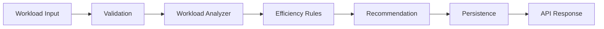
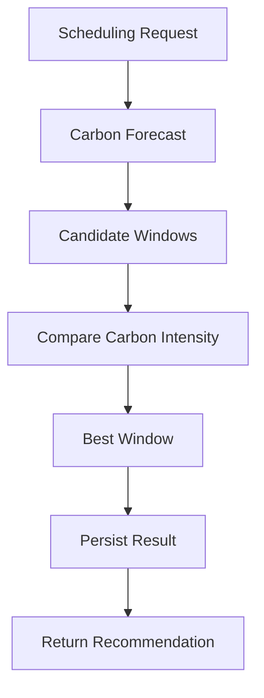
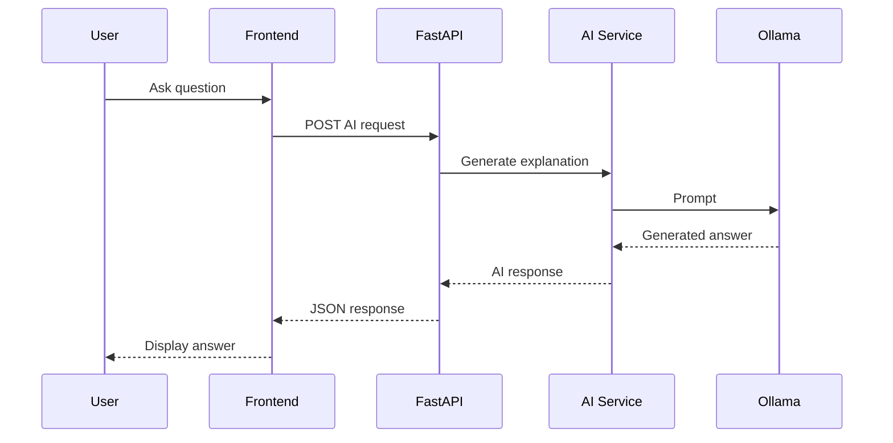
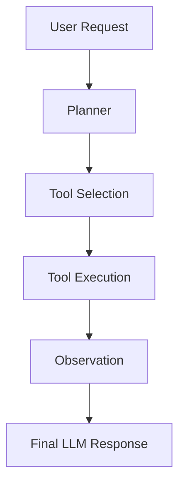
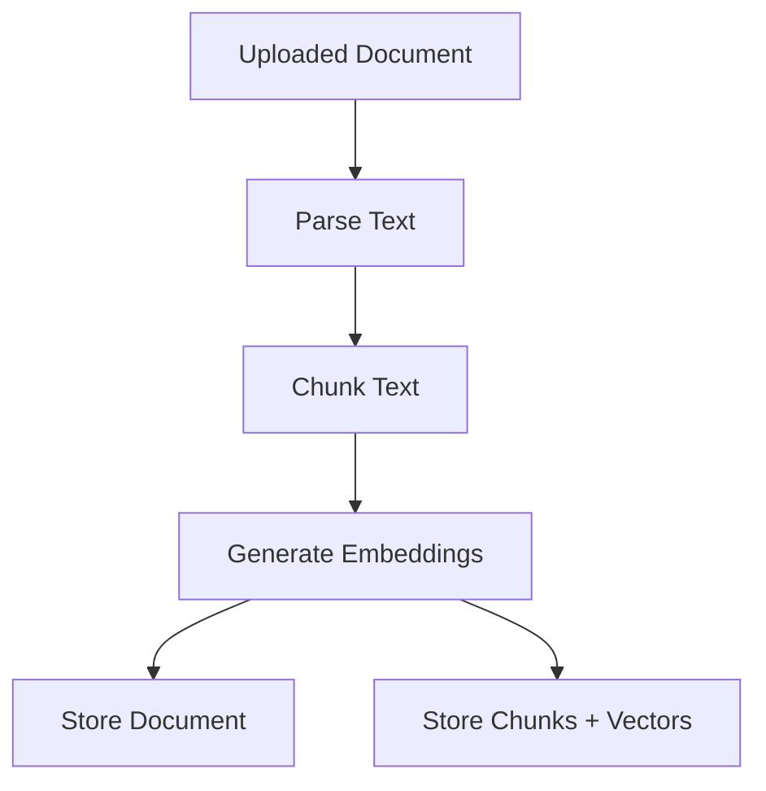
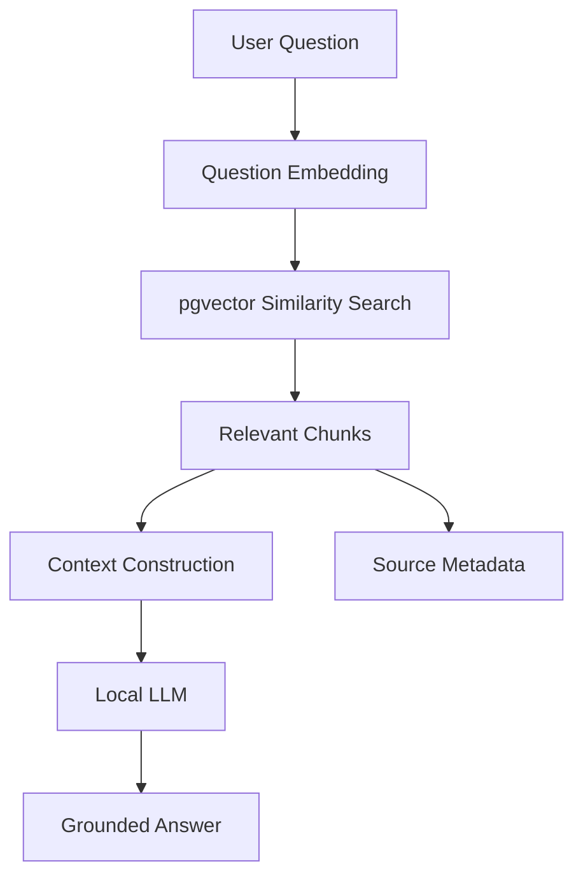
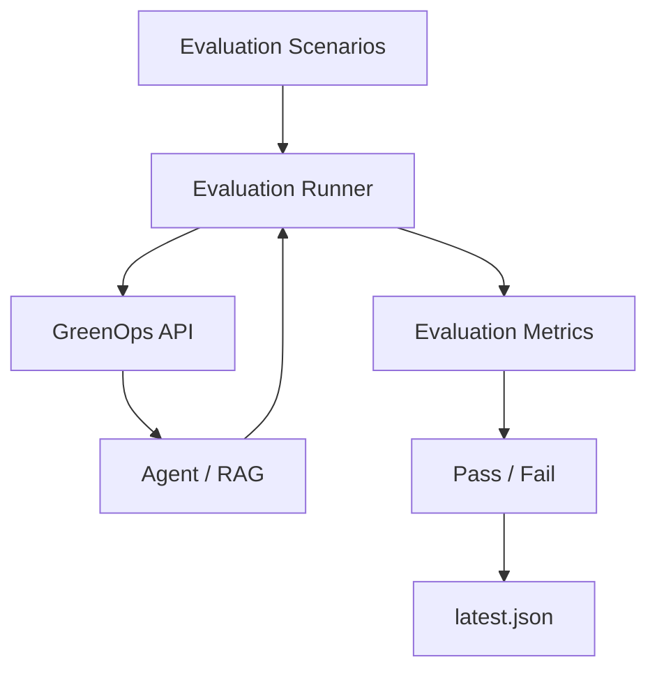
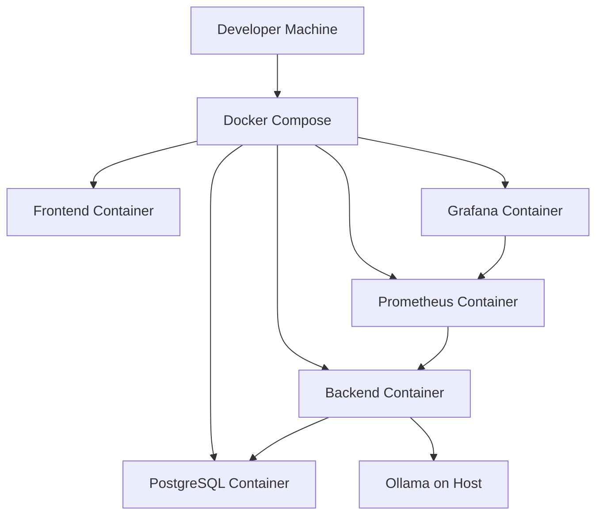

# GreenOps AI Architecture

## 1. Overview

GreenOps AI is an open-source AI Engineering and GreenOps platform designed to analyze workload efficiency, estimate carbon impact, recommend lower-carbon execution windows, provide AI-assisted explanations, support agentic tool use, and answer technical questions using Retrieval-Augmented Generation (RAG).

The system is designed as a modular full-stack application with:

- a React + TypeScript frontend
- a FastAPI backend
- PostgreSQL persistence
- pgvector for semantic retrieval
- Ollama for local LLM generation and embeddings
- Prometheus for metrics collection
- Grafana for observability
- Docker Compose for local orchestration
- GitHub Actions for CI
- an internal AI evaluation framework

The architecture intentionally keeps the main application local-first and does not require a paid cloud LLM API.

---

## 2. High-Level Architecture

```mermaid
flowchart TD

    USER[User]

    FRONTEND[React + TypeScript Frontend]

    API[FastAPI API]

    WORKLOAD[Workload Analyzer]
    CARBON[Carbon Intelligence]
    SCHEDULER[Carbon-Aware Scheduler]

    ASSISTANT[AI Assistant]
    AGENT[AI Agent]
    TOOLS[Agent Tools]

    RAG[RAG Service]
    RETRIEVER[Semantic Retriever]

    OLLAMA[Ollama]

    LLM[llama3.2:3b]
    EMBEDDINGS[nomic-embed-text]

    POSTGRES[(PostgreSQL)]
    PGVECTOR[(pgvector)]

    METRICS[/metrics]
    PROMETHEUS[Prometheus]
    GRAFANA[Grafana]

    USER --> FRONTEND
    FRONTEND --> API

    API --> WORKLOAD
    API --> CARBON
    API --> SCHEDULER
    API --> ASSISTANT
    API --> AGENT
    API --> RAG

    AGENT --> TOOLS

    TOOLS --> WORKLOAD
    TOOLS --> CARBON
    TOOLS --> SCHEDULER
    TOOLS --> RAG

    ASSISTANT --> OLLAMA
    AGENT --> OLLAMA

    OLLAMA --> LLM
    RAG --> EMBEDDINGS
    EMBEDDINGS --> OLLAMA

    RAG --> RETRIEVER
    RETRIEVER --> PGVECTOR

    PGVECTOR --> POSTGRES

    WORKLOAD --> POSTGRES
    SCHEDULER --> POSTGRES
    RAG --> POSTGRES

    API --> METRICS
    METRICS --> PROMETHEUS
    PROMETHEUS --> GRAFANA
```

---

## 3. Architectural Goals

GreenOps AI is designed around the following goals:

### 3.1 Modularity

Application features are separated into:

- API routes
- schemas
- services
- repositories
- database models
- AI providers
- agent tools
- observability modules

This makes individual capabilities easier to test, extend, and replace.

### 3.2 Local-First AI

GreenOps AI uses Ollama for:

- text generation
- AI explanations
- agent reasoning
- embeddings

This keeps the first release free from paid LLM API dependencies.

### 3.3 Explainability

The platform does not only calculate results.

It also aims to explain:

- why a workload is inefficient
- which optimization is being recommended
- how carbon intensity affects scheduling
- which documentation supports a RAG answer
- which tools an AI agent selected

### 3.4 Grounded AI

The Knowledge Base uses RAG so that technical answers can be grounded in uploaded documentation rather than relying only on model memory.

### 3.5 Measurability

Prometheus metrics and Grafana dashboards make both standard HTTP behavior and AI-specific operations observable.

### 3.6 Testability

The project includes:

- backend unit/integration tests
- AI behavior tests
- RAG tests
- observability tests
- an evaluation framework
- frontend lint/build checks
- CI automation

---

## 4. Repository Structure

```text
greenops-ai/
│
├── backend/
│   ├── alembic/
│   │   └── versions/
│   │
│   ├── app/
│   │   ├── api/
│   │   │   └── routes/
│   │   │
│   │   ├── core/
│   │   │   └── config.py
│   │   │
│   │   ├── db/
│   │   │   ├── base.py
│   │   │   ├── models.py
│   │   │   └── session.py
│   │   │
│   │   ├── observability/
│   │   │   ├── metrics.py
│   │   │   └── middleware.py
│   │   │
│   │   ├── repositories/
│   │   │
│   │   ├── schemas/
│   │   │
│   │   └── services/
│   │       ├── agent/
│   │       ├── ai/
│   │       ├── carbon/
│   │       └── rag/
│   │
│   ├── tests/
│   ├── Dockerfile
│   ├── entrypoint.sh
│   └── requirements.txt
│
├── frontend/
│   ├── src/
│   │   ├── components/
│   │   ├── pages/
│   │   ├── services/
│   │   └── types/
│   ├── Dockerfile
│   └── nginx.conf
│
├── evaluation/
│   ├── fixtures/
│   ├── results/
│   ├── metrics.py
│   ├── run_evaluation.py
│   └── scenarios.json
│
├── observability/
│   ├── grafana/
│   │   ├── dashboards/
│   │   └── provisioning/
│   └── prometheus/
│
├── datasets/
├── docs/
├── scripts/
│
├── docker-compose.yml
├── .env.example
├── CONTRIBUTING.md
├── LICENSE
└── README.md
```

---

## 5. Frontend Architecture

The frontend is built with:

- React
- TypeScript
- Vite

Its responsibility is to provide a user interface for the core GreenOps AI capabilities.

Main UI areas include:

- Overview
- Workloads
- Carbon Intelligence
- Carbon Scheduler
- AI Assistant
- AI Agent
- Knowledge Base

The frontend communicates with the FastAPI backend through typed service modules.

A typical request flow is:

```text
React page
   ↓
frontend service
   ↓
FastAPI endpoint
   ↓
domain service
   ↓
response
   ↓
React state
   ↓
UI
```

The frontend does not directly access PostgreSQL, Ollama, Prometheus, or other backend dependencies.

---

## 6. Backend Architecture

The backend is built using FastAPI.

The main layers are:

```text
API Routes
    ↓
Schemas
    ↓
Services
    ↓
Repositories
    ↓
Database / External Providers
```

### API Routes

Routes expose HTTP endpoints and are responsible for:

- request validation
- dependency injection
- calling domain services
- converting service failures into HTTP responses
- returning API schemas

### Schemas

Pydantic schemas define:

- request payloads
- response payloads
- internal typed data structures

### Services

Services contain domain logic such as:

- workload analysis
- carbon forecasting
- workload scheduling
- RAG retrieval
- embeddings
- agent planning
- AI generation

### Repositories

Repositories separate persistence logic from service logic.

They are responsible for interacting with SQLAlchemy sessions and database models.

---

## 7. Workload Analyzer

The Workload Analyzer evaluates workload configuration and usage information.

It can inspect values such as:

- CPU usage
- memory usage
- replica count
- runtime

Its goal is to identify inefficient resource allocation.

Example flow:



Typical findings can include:

- over-provisioned CPU
- over-provisioned memory
- excessive replicas
- possible resource savings

---

## 8. Carbon Intelligence

The Carbon Intelligence component retrieves and normalizes external carbon-intensity information.

The current system uses a carbon-intensity provider integration.

Typical flow:

```text
Frontend
   ↓
FastAPI carbon endpoint
   ↓
Carbon provider service
   ↓
External carbon API
   ↓
Normalized GreenOps response
   ↓
Frontend
```

This information can then be used by:

- Carbon Intelligence UI
- Carbon Scheduler
- AI Agent tools

---

## 9. Carbon-Aware Scheduler

The scheduler uses carbon-intensity forecast data to find a lower-carbon execution window.

Input can include:

- workload name
- runtime duration
- maximum allowed delay

The scheduler searches the available forecast and chooses an execution window that improves carbon conditions while respecting the delay constraint.

Flow:



The scheduler does not directly execute infrastructure workloads in v1.0.

It provides a scheduling recommendation.

---

## 10. AI Provider Architecture

GreenOps AI uses an abstraction around AI providers.

The current provider is Ollama.

AI operations include:

- text generation
- AI explanations
- agent planning
- embeddings

The default text-generation model is:

```text
llama3.2:3b
```

The default embedding model is:

```text
nomic-embed-text
```

Provider failures are converted into application-specific exceptions so API routes do not depend directly on raw HTTP client errors.

---

## 11. AI Assistant

The AI Assistant provides natural-language explanations of GreenOps-related information.

Typical flow:



The assistant is intentionally separate from the AI Agent.

The assistant primarily generates explanations, while the Agent can select and execute tools.

---

## 12. Agentic AI Architecture

The AI Agent supports tool-based reasoning.

The agent receives a user request and determines which application tools are needed.

Available tool capabilities include:

- workload analysis
- current carbon lookup
- lower-carbon scheduling
- documentation search

The general agent flow is:



The tool layer provides a controlled interface between the AI planner and application services.

This is important because the model does not directly execute arbitrary application code.

---

## 13. Agent Tool Architecture

Each tool represents a specific operation that the agent is allowed to request.

Conceptually:

```text
AI Planner
   ↓
Tool Name + Arguments
   ↓
Tool Registry
   ↓
Validated Tool
   ↓
Application Service
   ↓
Structured Observation
   ↓
AI Planner / Final Response
```

This design provides:

- explicit tool boundaries
- predictable service access
- easier testing
- tool-level observability
- safer agent behavior

---

## 14. Retrieval-Augmented Generation

The Knowledge Base provides document-grounded AI answers.

Users can upload technical documents such as:

- runbooks
- Markdown documentation
- architecture documentation
- deployment instructions
- configuration documentation

RAG ingestion flow:



Question-answering flow:



---

## 15. Embeddings and Vector Search

GreenOps AI uses:

```text
nomic-embed-text
```

for embeddings.

The current expected embedding dimension is:

```text
768
```

Document vectors are stored through PostgreSQL with pgvector.

Vector retrieval is used to locate chunks semantically related to a user question.

This enables queries where the user does not need to use the exact wording found in the source document.

---

## 16. PostgreSQL and Persistence

PostgreSQL is the primary application database.

It stores application state such as:

- workload analysis history
- carbon scheduling history
- RAG documents
- document chunks
- vector embeddings

SQLAlchemy is used as the ORM/data access layer.

Alembic manages schema migrations.

pgvector extends PostgreSQL with vector similarity capabilities.

---

## 17. Database Migration Architecture

Alembic manages versioned schema changes.

Typical workflow:

```text
SQLAlchemy models
      ↓
Alembic revision
      ↓
Migration file
      ↓
alembic upgrade head
      ↓
PostgreSQL schema
```

The project also ensures the PostgreSQL `vector` extension exists before vector-backed tables are used.

---

## 18. Health and Readiness

GreenOps AI exposes separate health concepts.

### Health

```text
GET /api/v1/health
```

This confirms that the FastAPI application is running.

### Readiness

```text
GET /api/v1/health/ready
```

This checks whether required dependencies such as the database are available.

Expected ready response:

```json
{
  "status": "ready",
  "database": "ready"
}
```

If the database is unavailable, the endpoint returns an HTTP `503 Service Unavailable` response.

This separation is useful for:

- Docker health checks
- load balancers
- container orchestration
- future Kubernetes readiness probes

---

## 19. Observability Architecture

GreenOps AI exposes Prometheus metrics from:

```text
GET /metrics
```

The observability flow is:

```mermaid
flowchart LR

    API[FastAPI]
    M[/metrics]
    P[Prometheus]
    G[Grafana]

    API --> M
    P --> M
    P --> G
```

Prometheus periodically scrapes the backend.

Grafana uses Prometheus as a data source.

---

## 20. Application Metrics

HTTP-level metrics include:

- total request count
- request duration
- HTTP method
- route
- response status

These metrics make it possible to monitor:

- request volume
- endpoint latency
- error responses
- API behavior over time

---

## 21. AI Metrics

AI-specific metrics include areas such as:

- LLM generation duration
- AI provider errors
- embedding duration
- RAG retrieval duration
- agent tool execution duration
- agent tool call count
- tool outcome

These metrics help answer questions such as:

- Which AI operation is slow?
- Is the embedding model creating latency?
- How frequently are agent tools used?
- Are AI provider errors increasing?
- Is RAG retrieval becoming slower?

---

## 22. Request ID Middleware

The backend uses request IDs for HTTP requests.

A request receives an identifier such as:

```text
x-request-id
```

The response includes the same identifier.

This provides a foundation for request correlation and future distributed tracing.

---

## 23. Prometheus

Prometheus runs as a Docker Compose service.

Its responsibilities are:

- scrape FastAPI metrics
- store time-series metrics
- expose query capabilities
- provide data to Grafana

Local URL:

```text
http://localhost:9090
```

---

## 24. Grafana

Grafana is provisioned automatically through files stored in:

```text
observability/grafana/
```

The GreenOps AI dashboard includes panels such as:

- HTTP Request Rate
- HTTP P95 Latency
- LLM Generation P95
- Embedding P95
- RAG Retrieval P95
- Agent Tool Calls

Local URL:

```text
http://localhost:3000
```

---

## 25. Evaluation Architecture

GreenOps AI includes a dedicated AI evaluation framework.

The evaluation system is separate from normal backend unit tests.

Its purpose is to validate behavior such as:

- correct tool selection
- required answer terms
- forbidden unsupported claims
- expected documentation source retrieval
- tool precision
- tool recall
- scenario latency

Evaluation flow:



Run:

```bash
python -m evaluation.run_evaluation
```

The current evaluation target is:

```text
Passed: 4/4
Pass rate: 100.0%
```

---

## 26. Testing Architecture

The backend test suite validates areas including:

- health
- readiness
- carbon services
- workload analysis
- carbon scheduling
- database persistence
- AI integration
- agent behavior
- RAG
- observability

The frontend uses:

- lint checks
- production build validation

The project also uses Python compilation checks to catch syntax/import issues.

---

## 27. CI Architecture

GitHub Actions provides automated quality gates.

The CI pipeline validates areas such as:

```text
Push / Pull Request
        ↓
GitHub Actions
        ↓
Backend Tests
        ↓
Frontend Checks
        ↓
Docker Build Validation
        ↓
Merge Confidence
```

The purpose of CI is to detect regressions before changes are merged.

---

## 28. Docker Architecture

Docker Compose runs the local platform.

Services include:

- backend
- frontend
- PostgreSQL + pgvector
- Prometheus
- Grafana

Conceptually:



Ollama runs on the host machine in the current local architecture.

The backend container reaches it through the Docker host address configured for the environment.

---

## 29. Security Boundaries

GreenOps AI v1.0 is designed as a local engineering platform rather than a production multi-user SaaS application.

Current safeguards include:

- explicit agent tools
- schema validation
- environment-based configuration
- `.env` exclusion from source control
- controlled RAG ingestion
- provider exception handling

Current v1.0 limitations include:

- no authentication
- no authorization
- no multi-tenant isolation
- no per-user data separation
- local development credentials for services such as Grafana
- no secrets manager integration

These limitations should be addressed before production deployment.

---

## 30. Error Handling

External dependencies can fail.

Examples include:

- carbon API unavailable
- Ollama unavailable
- embedding model unavailable
- PostgreSQL unavailable

GreenOps AI converts provider-specific failures into application-level errors where possible.

This prevents lower-level networking/database exceptions from becoming the public API contract.

---

## 31. Configuration

Configuration is managed through environment variables and Pydantic settings.

Examples include:

- application version
- database URL
- Ollama base URL
- generation model
- embedding model
- embedding dimensions
- RAG chunk size
- CORS origins
- carbon provider URL

The repository includes:

```text
.env.example
```

as the configuration template.

Secrets should never be committed to the repository.

---

## 32. Data Flow Summary

### Workload Analysis

```text
Frontend
   ↓
FastAPI
   ↓
Workload Analyzer
   ↓
Recommendation
   ↓
PostgreSQL
   ↓
Frontend
```

### Carbon Intelligence

```text
Frontend
   ↓
FastAPI
   ↓
Carbon Provider
   ↓
External Carbon API
   ↓
Frontend
```

### Carbon Scheduling

```text
Frontend
   ↓
FastAPI
   ↓
Carbon Forecast
   ↓
Scheduler
   ↓
PostgreSQL
   ↓
Frontend
```

### AI Assistant

```text
Frontend
   ↓
FastAPI
   ↓
AI Service
   ↓
Ollama
   ↓
Local LLM
   ↓
Frontend
```

### AI Agent

```text
Frontend
   ↓
FastAPI
   ↓
Planner
   ↓
Tool Selection
   ↓
Application Service
   ↓
Observation
   ↓
Local LLM
   ↓
Final Response
```

### RAG

```text
Document
   ↓
Chunking
   ↓
Embedding
   ↓
pgvector

Question
   ↓
Embedding
   ↓
Similarity Search
   ↓
Relevant Chunks
   ↓
LLM
   ↓
Grounded Answer
```

### Observability

```text
Application Operations
   ↓
Prometheus Metrics
   ↓
Prometheus
   ↓
Grafana
```

---

## 33. Design Decisions

### Why FastAPI?

FastAPI provides:

- typed request/response models
- automatic OpenAPI documentation
- async support
- dependency injection
- strong Python AI ecosystem integration

### Why PostgreSQL?

PostgreSQL supports both normal relational persistence and pgvector-based semantic retrieval.

This allows the project to avoid operating a separate vector database in v1.0.

### Why Ollama?

Ollama provides a simple local runtime for:

- generation models
- embedding models

It enables the project to remain free of paid cloud LLM APIs.

### Why pgvector?

pgvector allows vector search inside PostgreSQL.

This keeps the first architecture simpler while still demonstrating production-relevant vector retrieval concepts.

### Why Prometheus and Grafana?

They are widely used observability tools and make it possible to demonstrate operational AI engineering rather than only feature-level functionality.

### Why an Internal Evaluation Framework?

Traditional unit tests are not enough for nondeterministic AI behavior.

The evaluation framework provides scenario-level checks for tool use, grounding, sources, and answer constraints.

---

## 34. v1.0 Scope

GreenOps AI v1.0 includes:

- workload analysis
- carbon-intensity integration
- carbon-aware scheduling
- PostgreSQL persistence
- local AI generation
- AI Assistant
- agentic AI
- tool calling
- RAG
- pgvector
- AI evaluation
- React frontend
- Docker Compose
- GitHub Actions CI
- Prometheus
- Grafana
- application and AI observability

---

## 35. Future Architecture

Potential future additions include:

- Kubernetes
- Helm charts
- authentication
- authorization
- multi-user support
- cloud workload discovery
- AWS adapters
- additional carbon providers
- OpenTelemetry tracing
- model routing
- cost-aware model selection
- advanced agent planning
- queue-based background jobs
- caching
- rate limiting
- secrets management
- managed production database support

Possible future high-level architecture:

```text
Cloud / Kubernetes
        │
        ▼
Ingress / API Gateway
        │
        ▼
GreenOps API
        │
 ┌──────┼───────────────┐
 ▼      ▼               ▼
Workers Agent Service   RAG Service
 │      │               │
 ▼      ▼               ▼
Queue   Model Router    Vector Store
 │
 ▼
Cloud Workload Integrations
```

These features are intentionally outside the v1.0 release scope.

---

## 36. Architecture Principles

GreenOps AI follows these principles:

1. Keep domain logic separate from HTTP routing.
2. Keep persistence separate from service logic.
3. Keep AI providers behind explicit interfaces.
4. Keep agent capabilities constrained through tools.
5. Ground documentation answers through RAG.
6. Measure AI operations, not only HTTP requests.
7. Test deterministic logic with unit tests.
8. Evaluate AI behavior with scenario-based evaluation.
9. Keep v1.0 local-first and reproducible.
10. Add infrastructure complexity only when it provides clear value.

---

## 37. Summary

GreenOps AI combines Green Software Engineering with modern AI Engineering.

The architecture demonstrates how a single end-to-end project can integrate:

- backend services
- frontend applications
- relational databases
- vector search
- local LLMs
- agentic AI
- RAG
- evaluation
- carbon-aware computing
- observability
- Docker
- CI/CD

The v1.0 architecture is intentionally focused on a reproducible local platform while leaving room for cloud-native expansion in future releases.
